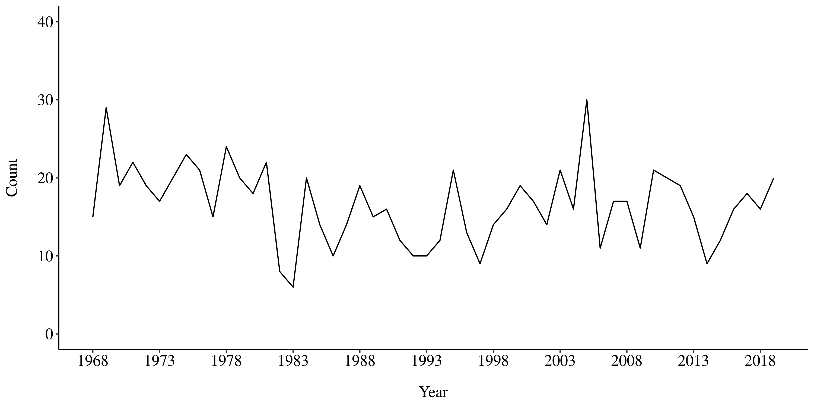

BIOS 611 Project: Atlantic Storm Data Analysis
================================================

Usage
-----

### Docker

You'll need Docker and the ability to run Docker as your current user.

This Docker container is based on rocker/verse. To build the Docker environment:

    > docker build . -t project1-env
    
To run r-studio server:

    > docker run -v `pwd`:/home/rstudio -p 8787:8787\
      -e PASSWORD=analysis -t project1-env
    
Then connect to the machine on port 8787. The username for r-studio is "rstudio" and the password is "analysis".

### Make 

To build figures in this project, such as the ones shown above, enter the 
following in the terminal inside r-studio:

    > make figures/storm_count.png
    
To build the final report:

    > make report.pdf
    
### Shiny 

To start the shiny dashboard, first build the docker environment as described above. Then run the following code in bash:
  
    > source aliases.sh
    > start_shiny storms_shiny 8788
    
If you want to run shiny on a port other than 8788, change the number to the desired port in the line above. 
  
Proposal
--------

### Introduction

There has been speculation that global warming could lead to an increase in the 
number and intensity of storms. The National Hurricane Center has released a 
public dataset called HURDAT2 of all the storms that have been recorded in the
Atlantic since 1851. This project will use the HURDAT2 data to see if there have 
been any patterns over the last few decades. 

### Objectives

1. Describe the characteristics of the Atlantic storms between 1968-2019.
2. Explore any trends in the number of storms over time.
3. Explore any trends in the intensity of storms over time.

### Dataset 

The HURDAT2 dataset from the National Hurricane Center contains the tracks and 
measurements of all recorded storms since 1851. This analysis will only consider 
the storms that were observed after 1968 when modern satellite surveillance 
was introduced. Prior to 1968, records relied on observations from ships and so 
it is likely that a number of storms were not counted. The data includes 
latitude, longitude, wind speed, and pressure of storms at several points along 
the track.

### Preliminary Figures

Figure 1 shows the number of storms recorded in the Atlantic between 1968 and 
2019. 

Classifing each storm according to the maximum intensity that was recorded and
considering only tropical cyclones (excluding subtropical and extratropical 
storms), figure 2 shows the number of storms by intensity over time. A 
tropical depression is the least intense and a hurricane is the most intense. 
There seems to be a trend towards more tropical storms and fewer tropical 
depressions.

These figures suggest that there may not be any trend in the number of overall 
storms but there may be a trend towards more intense storms.

### Analysis

Analysis will include descriptive statistics and figures and longitudinal 
regression models. The analysis will be complete when we have met the objectives
described above.