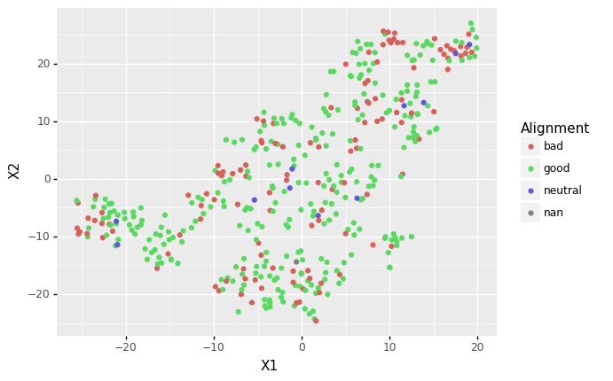

```{r setup, include=FALSE}
knitr::opts_chunk$set(echo = TRUE)
```

## Problem 1

Usually it would be necessary to split the data into three parts: training, validation, and testing. However, for this application I will not be tuning parameters and so I do not need a separate validation and testing data set. Therefore, I will split the data into two parts. The following code reads in the data and splits it into training and testing. I have chosen to split the data separately by gender.

```{r message=FALSE}

library(tidyverse)
library(MLmetrics)

f1<- MLmetrics::F1_Score

set.seed(963214)

genderData <- read_csv("datasets_26073_33239_weight-height.csv")

#Split the data into male and female 
male<-genderData %>% filter(Gender=="Male") 
female<-genderData %>% filter(Gender=="Female") 

#Separately divide the male and female data sets into train and test
setMale<-factor(c(rep("Train", nrow(male)*0.6), 
                  rep("Test",nrow(male)*0.4))) %>%
         sample(nrow(male), replace=FALSE)
male$set<-setMale  

setFemale<-factor(c(rep("Train", nrow(female)*0.6), 
                    rep("Test",nrow(female)*0.4))) %>%
           sample(nrow(female), replace=FALSE)
female$set<-setFemale     

# Put all the data together
genderData<- rbind(male, female)
genderData$femaleFlg<- genderData$Gender=="Female"

# Put train and test in separate data sets
train<-genderData %>% filter(set=="Train")
test<- genderData %>% filter(set=="Test")

```

Next, fit a gradient boosting machine to the training data set. The accuracy of this model is checked on the testing data set. 

```{r message=FALSE}

library(gbm)

# Fit a GBM on training data
modelGBM <- gbm(femaleFlg ~ Weight + Height, distribution ="bernoulli",
                data=train, n.trees = 100, interaction.depth = 2, 
                shrinkage=0.1)

# Calculate accuracy on test data
pred <- predict(modelGBM, newdata=test, type="response")
sum((pred>0.5)== test$femaleFlg)/nrow(test)

# Calculate F1 score on test data
f1(test$femaleFlg, pred>0.5, positive=TRUE)

```

The accuracy of the gradient boosting machine is much better with this data set than the data set that we used in homework 4. That is because, in this data set, there is a relationship between height, weight and gender. In the data set from homework 4, there was no association and so the gradient boosting machine was no better than guessing.

## Problem 2

The following code generates histograms of a couple of the numeric variables. We can use these histograms to help determine if there are any irregularities in the data.

```{r message=FALSE}

statsData <- read_csv("datasets_38396_60978_charcters_stats.csv")

ggplot(statsData, aes(x=Speed))+geom_histogram(binwidth = 5)

ggplot(statsData, aes(x=Total))+geom_histogram(binwidth = 5)

```

There seems to be a large number of records with total of 5. These records have intelligence, strength, speed, durability, and combat equal to 1 and power equal to 0. Perhaps for these records the value represents true/false or maybe the value is an indicator for missing. Either way, these records are not on the same scale as the rest and should probably be filtered out. After filtering out all records where the total score is 5, the histogram of the total score looks a lot more reasonable. 

```{r message=FALSE}

statsData <- statsData %>% filter(Total != 5)

ggplot(statsData, aes(x=Total))+geom_histogram(binwidth = 5)

```

The following code does principal component analysis for all numeric variables in the data set.

```{r message=FALSE}

pca<-prcomp(statsData[,3:9])
summary(pca)

```

From this we see that only one component is needed to cover 85% of the variation in the data. 

However, there are a few problems with this analysis. First of all, we should normalize the columns first. This is important if the dimensions have different variances. Since the goal of PCA is to explain the most variance, if one dimension has a higher variance than the others, this technique will put more weight on that dimension.

Secondly, we should not have included the total column. The total column is simply a sum of the individual skills and therefore is a linear combination of the other variables where each are weighted equally. This column adds no information to the data. The majority of the largest principal component will be this total column if we include it. 

```{r message=FALSE}

# Show the total column is just a sum of the individual skills
statsData$totalCheck<- statsData$Intelligence+statsData$Strength+ 
                       statsData$Speed+statsData$Durability+statsData$Power+
                       statsData$Combat-statsData$Total

length(statsData$totalCheck[statsData$totalCheck != 0])

```

The following code normalizes the columns and does principal component analysis excluding the total column.

```{r message=FALSE}

library(caret)

preProc<- preProcess(statsData[,3:8], method = "range")
normed<- as.matrix(predict(preProc, statsData[,3:8]))

pca<-prcomp(normed)
summary(pca)

```

Four components are needed to explain at least 85% of the variation in the data.The following code plots the first two components.

```{r message=FALSE}

# Transform the data using the rotation matrix
transformed <- do.call(rbind, Map(function(row){
  v <- solve(pca$rotation) %*% c(normed[row,1],
                                 normed[row,2],
                                 normed[row,3],
                                 normed[row,4],
                                 normed[row,5],
                                 normed[row,6]);
  tibble(c1=v[1],
         c2=v[2],
         c3=v[3],
         c4=v[4],
         c5=v[5],
         c6=v[6]);    
},
seq(nrow(normed))))

# Plot the first two components
transformed$Alignment<-statsData$Alignment
ggplot(transformed, aes(c1,c2))+ geom_point(aes(color=Alignment))

```

From this plot we can see that there is more variation in the first component than the second component. Otherwise, there is no clear patterns. 

## Problem 3 

The Jupyter notebook containing the Python code to perform TSNE dimensionality reduction is located in the same directory. Here I read in the results from a CSV 

```{r message=FALSE}

tsne <- read_csv("python_tsne.csv")

ggplot(tsne,aes(x=X1,y=X2)) + geom_point(aes(color=Alignment))

```

There are no clear clusters in the two dimension TSNE plot. 

## Problem 4

The plot from problem 3 was reproduced in Python with plotnine. See the Jupyter notebook for the code. 



## Problem 5 

The following code uses the Caret library to train a GBM model. 

```{r message=FALSE}

library(e1071)

# Remove records with missing alignment
statsData <- statsData %>% filter(!is.na(Alignment))

trainIndex <- createDataPartition(statsData$Alignment, p = .8, 
                                  list = FALSE, 
                                  times = 1)

statsData$Alignment <- factor(statsData$Alignment);

train_ctrl <- trainControl(method = "repeatedcv", number = 50, repeats=5);
gbmFit1 <- train(Alignment~Intelligence+Strength+Speed+Durability+Power+Combat,
                 data = statsData %>% slice(trainIndex), 
                 method = "gbm", 
                 trControl = train_ctrl,
                 verbose = FALSE)
summary(gbmFit1)
gbmFit1

```

Caret has found that final parameters for the best model are ntrees = 50, interaction.depth = 2, shrinkage = 0.1, and n.minobsinnode=10.


## Problem 6

The accuracy of the model depends on how we split the data into training and testing. It is possible that by chance we select a split that gives us an unusually high or low accuracy. Reporting the accuracy from a single split does not allow us to capture the variation in this metric. The accuracy actually has a distribution. A technique like k-fold cross validation allows us to estimate this distribution and estimate the mean accuracy. We then use this mean accuracy to compare models and select the parameters that give us the best model. 


## Problem 7

In recursive feature elimination you start by fitting the model with all the of the predictors. You then rank the features in order of importance and drop the least important one. You then fit the model again, rank the features again, and drop the least important feature. This process continues until you have the desired number of features in your model. Finally you compare the performance of the models in each step of the process and select the one with the best accuracy. This whole process can be repeated for different train/test splits. 

